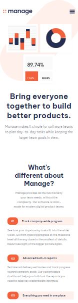

# Frontend Mentor - Manage landing page

An awesome landing page I made as a challenge on Frontend Mentor. It contains a lot of tweaks and order-changing settings for different page sizes, with proper navigation and testimonial slider at the bottom of the page.

## Table of contents

- [Overview](#overview)
  - [Screenshot](#screenshot)
  - [Links](#links)
- [Process](#process)
  - [Built with](#built-with)
  - [What I learned](#what-i-learned)
  - [Useful resources](#useful-resources)
- [Author](#author)

## Overview

Users should be able to:

- View the optimal layout for the site depending on their device's screen size
- See hover states for all interactive elements on the page
- See all testimonials in a horizontal slider
- Receive an error message when the newsletter sign up `form` is submitted if:
  - The `input` field is empty
  - The email address is not formatted correctly

### Screenshot

Desktop and mobile design of Manage landing page.




### Links

- Live Site URL: [Manage landing page](https://jelenkoo10.github.io/manage-landing-page/)

## Process

### Built with

- Semantic HTML5 markup
- CSS custom properties
- Flexbox
- CSS Grid
- CSS animations
- Regular expressions
- DOM manipulation
- Mobile-first workflow

### What I learned

Really proud of myself for implementing card slider at the bottom of the page, and for the first time I used classList functions that really helped me.

```js
function seeCard(number) {
    for (let i = 0; i < 4; i++) {
        if (i == number) {
            reviewCards[i].style.display = "block"
            if (!dots[i].classList.contains("selected")) {
                dots[i].classList.add("selected")
            }
        }
        else {
            reviewCards[i].style.display = "none"
            if (dots[i].classList.contains("selected")) {
                dots[i].classList.remove("selected")
            }
        }
    }
}
```

Also, I managed to learn how to change color of svg images when they're referred as background images of another css elements, using this cool filter property.

```css
.facebook:hover,
.twitter:hover,
.pinterest:hover,
.youtube:hover,
.instagram:hover,
.grid p:hover {
    cursor: pointer;
    filter: brightness(0) saturate(100%) invert(46%) sepia(49%) saturate(2722%) hue-rotate(339deg) brightness(98%) contrast(93%);
}
```


### Useful resources

- [Hex/RGB to filter color](https://isotropic.co/tool/hex-color-to-css-filter/) - This helped me translate my base orange color to filter that I used for hovering over svg icons.

## Author

- GitHub - [https://github.com/jelenkoo10](https://github.com/jelenkoo10)
- Frontend Mentor - [@jelenkoo10](https://www.frontendmentor.io/profile/jelenkoo10)
